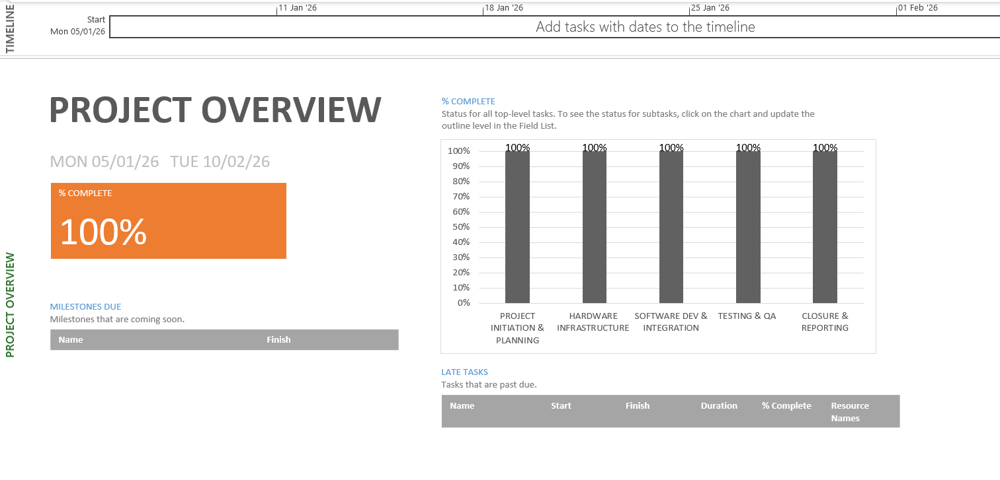
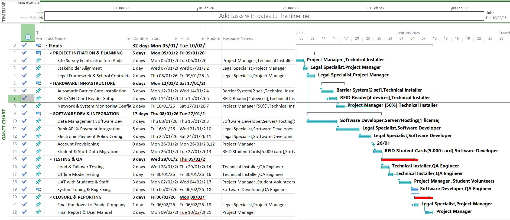
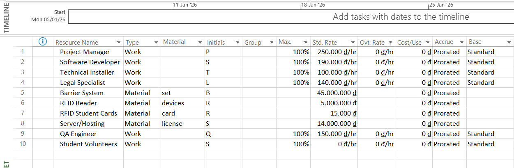
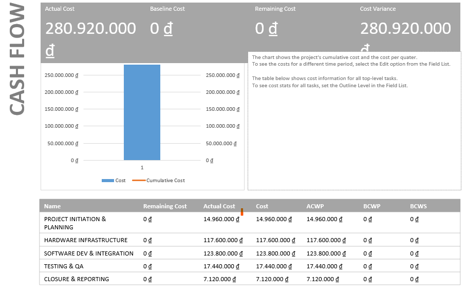

# Smart Parking System Optimization Project
*Collaboration with Panda Company | Academic Project - Ranked 2nd Place*

## 🚀 Project Overview
This project focuses on resolving campus traffic congestion and enhancing revenue transparency through an automated RFID-based parking management system. Developed as a final project for the **Project Management** course, it demonstrates a professional approach to scheduling, resource allocation, and financial tracking.

## 🛠 Management Highlights
- **Scope Management:** Comprehensive Work Breakdown Structure (WBS) with 5 major workstreams.
- **Time Management:** Precise scheduling with Lead/Lag times and **Critical Path Analysis**.
- **Resource Management:** Cost-to-use and rate-based allocation for both Labor and Material resources.
- **Tools Used:** Microsoft Project (Expert Level), Advanced Excel.

## 📊 Visual Portfolio

### 1. Execution Dashboard
Overview of the project status showing 100% completion across Initiation, Infrastructure, Software, and Testing phases.

### 2. Gantt Chart & Logic Flow
Demonstrating complex task dependencies and the **Critical Path** (highlighted in red) to ensure zero-bottleneck delivery.

### 3. Resource & Cost Analysis
Detailed resource sheet managing a ~281M VND budget, including labor rates (PM, Dev, QA) and high-value materials (Barrier Systems, RFID Readers).

### 4. Financial Health (Cash Flow)
Visualization of project expenditures over time to monitor budget burn rates.

## 📁 Repository Contents
- `Finals.mpp`: Original Microsoft Project file for technical scheduling review.
- `README.md`: Project documentation and visual showcase.
- `*.png`: High-resolution snapshots of project reports and dashboards.

---
*Note: This project is part of the Industrial Management curriculum, focused on applying technical logic to operational efficiency.*
